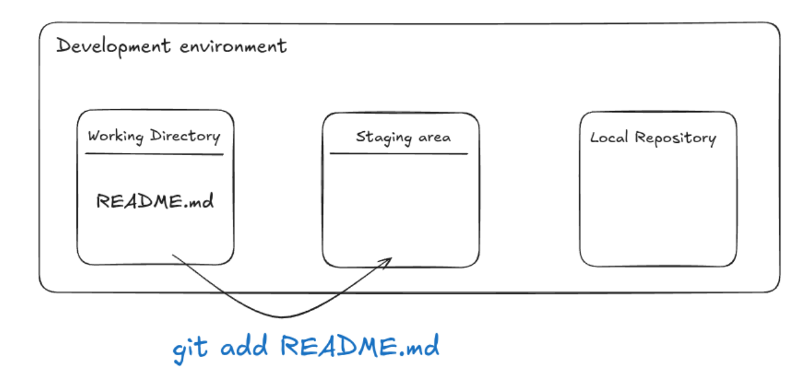
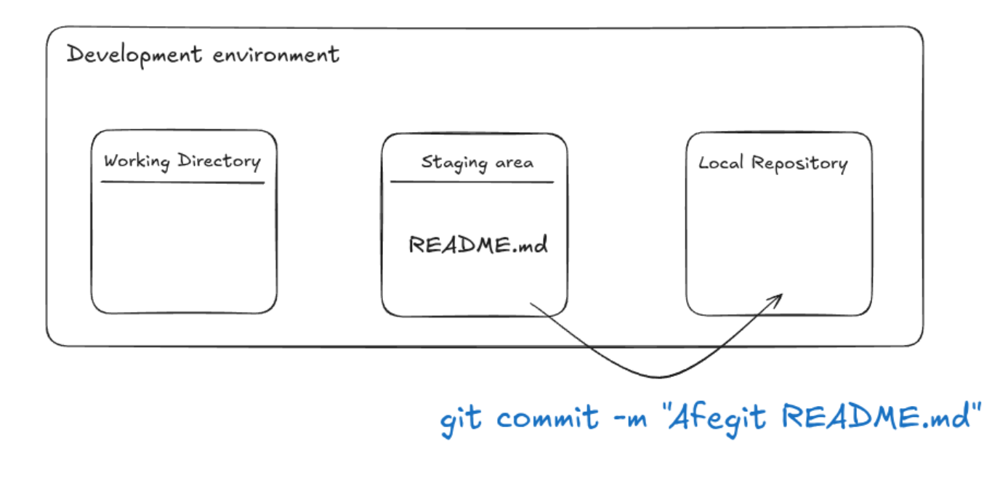

# Part 1: Repositoris locals

## Què és un repositori local?

Un repositori local és una carpeta al vostre ordinador on Git emmagatzema tots els fitxers i la informació sobre el vostre projecte. Cada repositori conté un historial complet de tots els canvis que heu fet, així com les branques i etiquetes associades al projecte.

És important entendre l'estructura d'un repositori local per poder treballar amb Git de manera eficient. Un repositori local conté diversos fitxers i carpetes que ajuden a gestionar el projecte. A continuació, es mostra una imatge de l'estructura típica d'un repositori local:


El "working directory" és la carpeta on treballeu actualment. Conté els fitxers del vostre projecte i és on feu els canvis. El "staging area" és una zona intermèdia on podeu preparar els fitxers abans de fer un commit. Finalment, el "repository" és on Git emmagatzema l'historial complet del vostre projecte.

## Crear un repositori local

Per crear un repositori local, podeu utilitzar la comanda `git init`. Aquesta comanda crea una nova carpeta oculta anomenada `.git` dins del vostre directori de treball, que és on Git emmagatzema tota la informació sobre el vostre projecte.

Per exemple, anem a crear una carpeta anomenada `provaGit`, i després podeu crear un repositori local executant la següent comanda:

```bash
cd provaGit
git init
```

Això crearà un nou repositori local dins de la carpeta `provaGit`. Ara podeu començar a afegir fitxers i fer canvis al vostre projecte.

## Afegir fitxers al repositori

Per seguir amb la prova anem a crear un fitxer ``README.md`` dins de la carpeta `provaGit` i afegir-hi una breu descripció del projecte. Podeu fer-ho amb qualsevol editor de text, com ara Visual Studio Code.

Un cop tingueu el fitxer creat, podeu afegir-lo a l'staging area executant la comanda següent:

```bash
git add README.md
```



Aquesta comanda indica a Git que voleu afegir el fitxer `README.md` a l'staging area, preparant-lo per al següent commit. Si voleu afegir tots els fitxers del directori, podeu utilitzar la comanda `git add .`, que afegeix tots els fitxers nous i modificats.

Ja només queda fer el commit per guardar els canvis. Podeu fer-ho executant la següent comanda:

```bash
git commit -m "Afegit README.md"
```



## Consultar informació del repositori

Per consultar informació sobre el vostre repositori, podeu utilitzar la comanda `git status`. Aquesta comanda us mostrarà l'estat actual del vostre repositori, incloent els fitxers que heu afegit a l'staging area i els fitxers que han estat modificats però no afegits.

```bash
git status
```

Si volem veure l'historial de commits, podeu utilitzar la comanda `git log`. Aquesta comanda us mostrarà una llista de tots els commits que heu fet al vostre repositori, juntament amb informació com l'autor, la data i el missatge del commit.

```bash
git log
```

És important que entenguem quina informació ens proporciona el log, que és molta, per entendre com funciona Git.

Vos hauria d'haver eixit una informació pareguda a esta:

```bash
commit a7a541abf1b61c8c155bfadb5c3ca9cc7d0bcfd6 (HEAD -> main)
Author: jordicido <jordi.cidoncha4@gmail.com>
Date:   Fri Apr 11 09:37:37 2025 +0200

    Afegit README.md
```

En esta eixida podem observar:

- El commit és identificat per un hash (a7a541abf1b61c8c155bfadb5c3ca9cc7d0bcfd6), que és un identificador únic per a cada commit.
- El commit actual és el HEAD, que indica la branca actual en la qual estem treballant (en este cas, `main`).
- L'autor del commit és `jordicido`, que és el nom d'usuari configurat anteriorment.
- La data i hora del commit.
- El missatge del commit és "Afegit README.md", que és el missatge que hem afegit quan hem fet el commit.

Quan comencem a fer diversos commits, el log començarà a fer-se llarg i difícil de llegir. Per això, podem utilitzar la comanda `git log --oneline`, que ens mostrarà una versió més compacta de l'historial de commits, mostrant només el hash i el missatge del commit.

```bash
git log --oneline
```

En este cas podem vore una llista de commits més compacta, amb només el hash i el missatge del commit. Això és útil per obtenir una visió ràpida de l'historial del vostre repositori.

```bash
a7a541a (HEAD -> main) Afegit README.md
```

## Configurar arxius a ignorar

Imaginem que al nostre projecte tenim un fitxer anomenat `config.txt` que conté informació secreta, com claus o contrasenyes, o inclús informació personal. No volem que aquest fitxer sigui afegit al repositori, ja que podria ser exposat a altres persones. Per evitar-ho, podem crear un fitxer anomenat `.gitignore` dins del nostre repositori i afegir-hi el nom del fitxer o carpeta que volem ignorar.

Per exemple, podeu crear un fitxer `.gitignore` dins de la carpeta `provaGit` i afegir-hi el següent contingut:

```bash
config.txt
```

Això indicarà a Git que ignori el fitxer `config.txt` i no l'afegisca al repositori. Podeu afegir altres fitxers o carpetes al fitxer `.gitignore` separant-los amb una nova línia.

## Afegir fitxers i canvis al repositori

Ara ens interessa realitzar diversos canvis per forçar un historial de canvis més llarg. Afegiu fitxers al projecte, modifiqueu-los i torneu a fer `git add` i `git commit` per afegir els canvis al repositori. Feu 3 o 4 commits més pel vostre compte, i després podeu continuar amb la següent part del taller.
