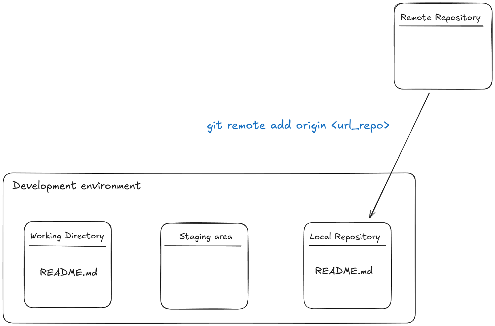
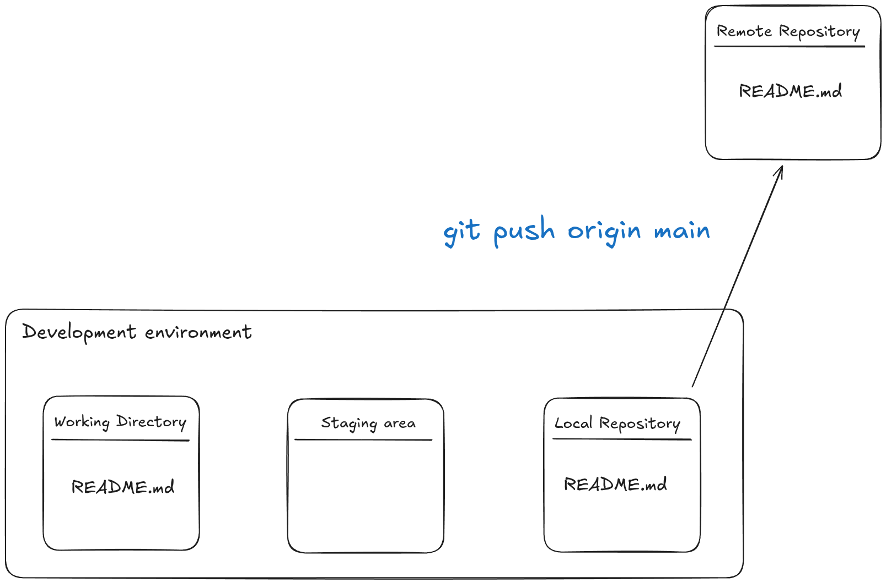

# Part 3: Repositoris remots

Una vegada ja hem vist els aspecte bàsics dels repositoris locals, anem a explorar una de les funcions més interessants de Git, el seu aspecte col·laboratiu. Els repositoris remots ens permeten compartir el nostre codi amb altres persones i col·laborar en projectes de manera eficient. En aquesta secció, veurem com treballar amb repositoris remots, com afegir-los al nostre projecte local i com pujar els nostres canvis.

## Què és un repositori remot?

Un repositori remot és una versió del nostre projecte que es troba allotjada en un servidor extern. Això ens permet compartir el nostre codi amb altres persones i col·laborar en projectes de manera eficient. Els repositoris remots són essencials per a la col·laboració en equip i per a la gestió de projectes de codi obert.

## Què és GitHub?

GitHub és una plataforma de desenvolupament que utilitza Git com a sistema de control de versions. Permet als usuaris allotjar els seus repositoris remots, col·laborar amb altres persones i gestionar projectes de codi obert. GitHub ofereix una interfície web per gestionar els repositoris, així com eines per a la revisió de codi, seguiment d'errors i gestió de projectes.
GitHub és una de les plataformes més populars per allotjar repositoris remots i és àmpliament utilitzada per desenvolupadors de tot el món.

## Creació d'un repositori remot

Per crear un repositori remot a GitHub, segueix aquests passos:

1. Inicia sessió al teu compte de GitHub.
2. Fes clic al botó "New" (Nou) a la pàgina principal.
3. Omple el formulari amb el nom del repositori, la descripció i la visibilitat (públic o privat).
4. Fes clic al botó "Create repository" (Crear repositori).
5. Ara tens un repositori remot buit a GitHub.

## Afegir un repositori remot

Fins ara teniem el nostre repositori local deslligat de qualsevol repositori remot. Això, tot i ser útil, no explota totes les funcionalitats de Git. Ara veurem com afegir un repositori remot al nostre projecte local.

Per afegir un repositori remot, utilitzarem la comanda `git remote add`. Aquesta comanda ens permet afegir un repositori remot al nostre projecte local. La sintaxi és la següent:

```bash
git remote add <nom_remot> <url_remot>
```

Per conveni s'utilitza el nom `origin` per referir-se al repositori remot principal.



De moment, com podem vore al diagrama, el repositori remot és un repositori buit. Per tant, no hi ha cap fitxer al repositori remot. El nostre repositori local conté els fitxers i el repositori remot no conté res. Ara veurem com pujar els nostres fitxers al repositori remot.

## Pujar fitxers al repositori remot

Per pujar els nostres fitxers al repositori remot, utilitzarem la comanda `git push`. Aquesta comanda ens permet pujar els nostres canvis al repositori remot. La sintaxi és la següent:

```bash
git push <nom_remot> <nom_branque>
```

Per exemple, si volem pujar els nostres canvis a la branca `main` del repositori remot `origin`, utilitzarem la següent comanda:

```bash
git push origin main
```



Ara, si anem al nostre repositori remot a GitHub, veurem que els nostres fitxers s'han pujat correctament. Però no només es pugen fitxers al repositori remot, sinó que també es puja la història de commits. Això vol dir que podem veure tots els canvis que hem fet al nostre projecte i qui els ha fet. Això és molt útil per a la col·laboració en equip i per a la gestió de projectes de codi obert.

## Descarregar canvis del repositori remot

Per descarregar canvis del repositori remot, utilitzarem la comanda `git pull`. Aquesta comanda ens permet descarregar els canvis del repositori remot i fusionar-los amb el nostre repositori local. La sintaxi és la següent:

```bash
git pull <nom_remot> <nom_branque>
```

Per exemple, si volem descarregar els canvis de la branca `main` del repositori remot `origin`, utilitzarem la següent comanda:

```bash
git pull origin main
```

Això farà el contrari del que feia la comanda git push, agarrarà la informació que hi ha al repositori remot anomenat origin i la fusionara amb la branca main del nostre repositori local.

## Connexió per terminal a GitHub

És recomanable que vos configureu un certificat SSH per a poder connectar-vos a GitHub des de la terminal. Això us permetrà pujar i descarregar fitxers del repositori remot sense haver d'introduir el vostre nom d'usuari i contrasenya cada vegada. Per configurar el certificat SSH, consulteu la documentació oficial de GitHub: [Connecting to GitHub with SSH](https://docs.github.com/en/authentication/connecting-to-github-with-ssh).
